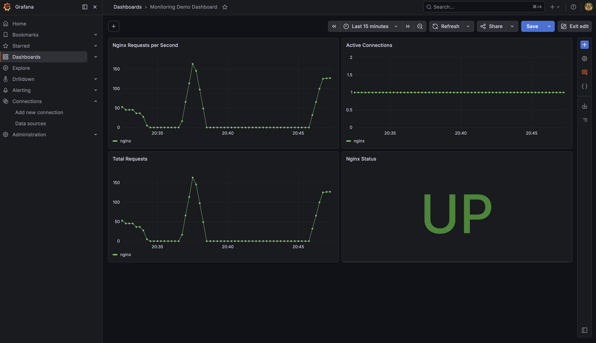

# Monitoring Demo (Prometheus & Grafana)

## Purpose

Demonstrates how to monitor services using Prometheus for metrics collection and Grafana for visualization.

---

## Architecture

Services → Prometheus → Grafana

---

## Features

- Metrics collection with Prometheus
- Visualization with Grafana
- Basic service monitoring
- Nginx metrics integration

---

## Run

```bash
docker compose up -d --build
```

---

## Access

Grafana:  
http://localhost:3000  

Prometheus:  
http://localhost:9090  

---

## Dashboard



---

## What I Learned

- Observability fundamentals
- Metrics collection
- Monitoring system setup
- Visualization with dashboards

---

## Why It Matters

Monitoring is critical in production systems to detect failures and understand system behavior.

---

## Note

Learning project – not production-ready.