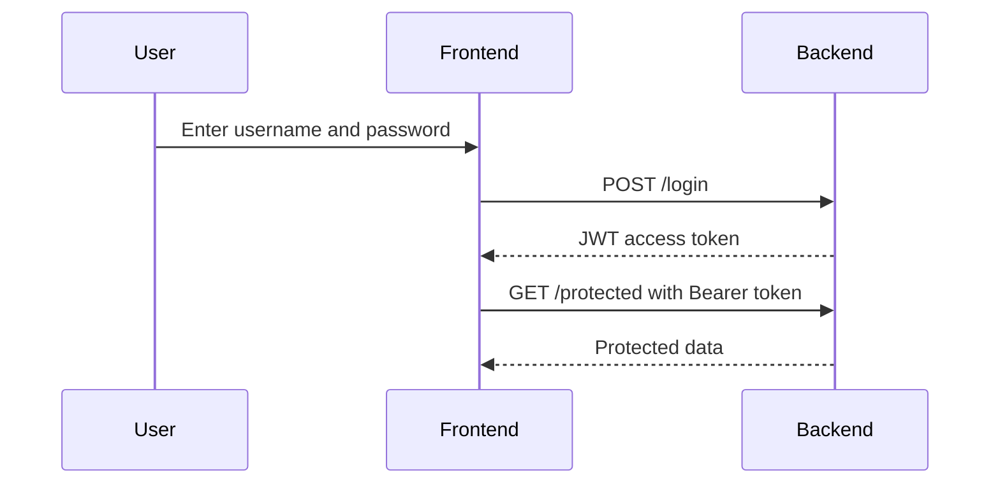
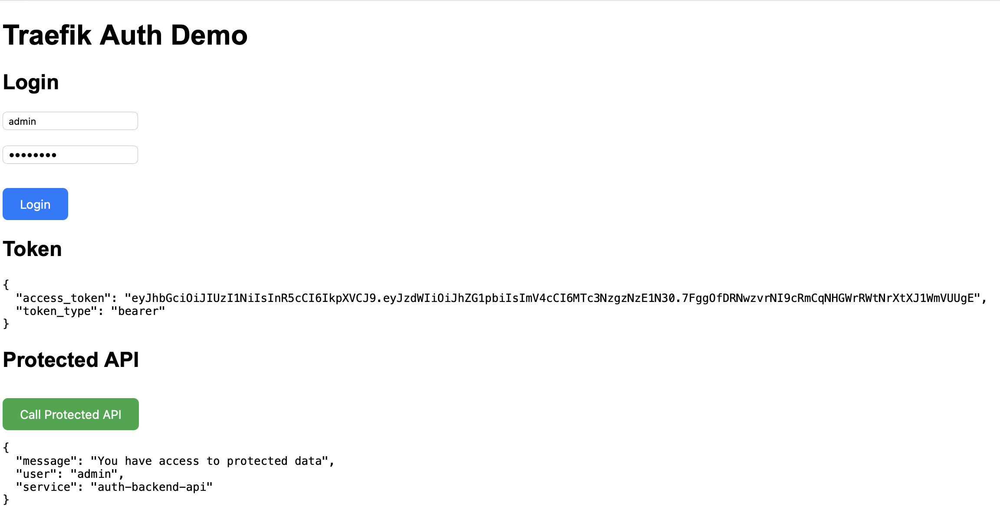

# Traefik Auth Demo

## Purpose

JWT-based authentication and authorization with Traefik, FastAPI, and a simple frontend.

---

## Architecture

Browser → Traefik → Frontend / Backend

Flow:

User → Login → JWT → Protected API

---

## Authentication Flow



---

## Demo



---

## Features

- Traefik reverse proxy routing
- FastAPI backend
- JWT token generation
- Protected API endpoint
- Bearer token authentication

---

## Project Structure

0008-traefik-auth-demo/
├── docker-compose.yml
├── frontend/
│   └── index.html
└── backend/
    ├── Dockerfile
    ├── requirements.txt
    └── app.py

---

## Run

```bash
docker compose up -d --build
```

---

## Test

Login:

```bash
curl -X POST http://api.auth.localhost/login \
  -H "Content-Type: application/json" \
  -d '{"username":"admin","password":"admin123"}'
```

Protected:

```bash
curl http://api.auth.localhost/protected \
  -H "Authorization: Bearer <TOKEN>"
```

---

## Demo Credentials

username: admin  
password: admin123  

---

## What I Learned

- JWT authentication flow
- Stateless auth
- API protection
- Reverse proxy routing with Traefik

---

## Why It Matters

Authentication is a core part of modern applications.

In real-world systems, this is usually handled by external identity providers such as Keycloak or Auth0.

---

## Notes

- Uses in-memory user storage
- JWT is generated inside the backend
- No database integration

---

## Note

Learning project – not production-ready.